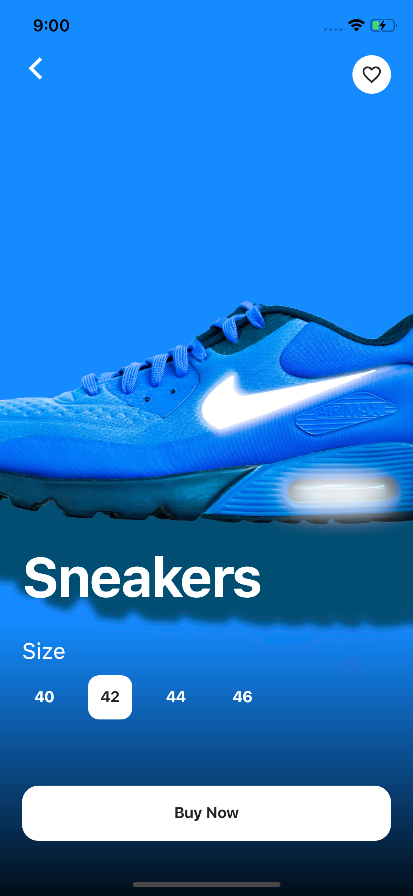
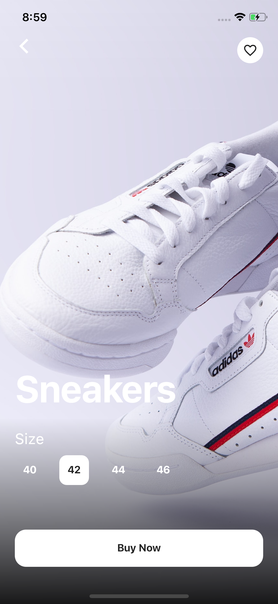

#Flutter - Animação e design de interface do usuário do aplicativo de loja de sapatos.

Projeto para estudo, loja de tênis, UI Design & Animation. 

#Sobre
Animação Flutter, Hero, Fade, Stack, Positioned, BoxShadow, TextField, Gradient, LinearGradient e assim por diante. 

#Video Aula - Canal @Afgprogrammer
[Youtube Video](https://youtu.be/lrMCjIYpnjg)

## ScreenShot

&nbsp;&nbsp;&nbsp;
